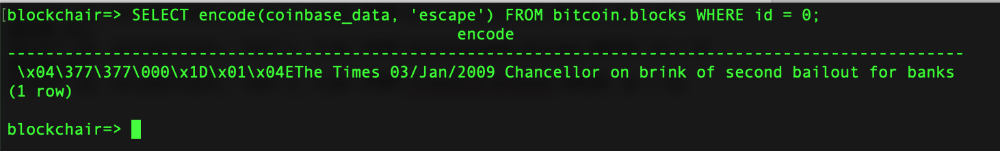

## [Blockchair.com](https://blockchair.com/) Direct SQL Access documentation


### Table of contents

+ [Changelog](#link_changelog)
+ [Overview](#link_overview)
+ [Obtaining access](#link_obtainingaccess)
+ [Connecting to the server](#link_connecting)
+ [Database schema](#link_schema)
+ [Query example](#link_example)
+ [Support](#link_support)



### <a name="link_changelog"></a> Changelog

* v.0.0.1 - May 3rd, 2019
    * We begin beta testing direct access to our databases. If you're interested in participating in the beta test, please reach us out at [<info@blockchair.com>](mailto:info@blockchair.com). Note that while in beta, there may be some compatibility breaking changes.
    
### <a name="link_overview"></a> Overview

Blockchair's Direct SQL Access allows you to query our databases directly bypassing our API. While in some cases our API works a lot faster (e.g. querying the balance of an address), sometimes it's handy to have an ability to execute an arbitrary query (e.g. you can create your own filters to aggregate data however you want, or you can use window functions).

We start with supporting three blockchains - Bitcoin (BTC), Bitcoin Cash (BCH), and Litecoin (LTC). More blockchains are coming in the future.

All our databases are working in real time - as soon as there's a new block it is instantly populated into the database.
    
### <a name="link_obtainingaccess"></a> Obtaining access

While Blockchair has a public API available without obtaining a key, this feature requires dedicated access. Please contact us at [<info@blockchair.com>](mailto:info@blockchair.com) for pricing. As always, we provide free access for academic purposes in some cases.

    
### <a name="link_connecting"></a> Connecting to the server

The database server is PostgreSQL 11.

The connection parameters are:
* Server: *\<redacted\>*
* Port: `5432`
* Login: *\<your personal username\>*
* Password: *\<your personal password\>*
* Database name: `blockchair`

The simplest way to connect is to use `psql` utility:

`$ psql -h <server> -p 5432 -U <login> blockchair`

Please note that we allow neither connections to the `postgres` database, nor access to `public` schemas. External users do not have writing permissions, including creating views.

By default, there's a limit of 1 connection per user.

### <a name="link_schema"></a> Database schema

The following schemas are available:
* `bitcoin`
* `bitcoincash`
* `litecoin`

Each schema contains:
* `blocks` table
* `transactions` table
* `outputs` table
* `usd(BIGINT, TIMESTAMP DEFAULT current_date)` function to convert satoshi values to USD values using exchange rate on a specified date

To get columns description use `\d`, e.g. `\d bitcoin.blocks`. The columns are consistent with the described columns in [the API documentation](API.md). There are no `*_usd` columns, please use the `usd` function instead (e.g. `blocks.output_total_usd` can be accessed as `usd(blocks.output_total, blocks.time)`).

There are following indexes available:
* `blocks.id`
* `blocks.hash`
* `transactions.block_id`
* `transactions.id`
* `transactions.hash`
* `outputs.block_id`
* `outputs.transaction_id`
* `outputs.spending_block_id`
* `outputs.spending_transaction_id`

### <a name="link_example"></a> Query example

```
blockchair=> SELECT id, encode(hash, 'hex'), time FROM bitcoin.blocks WHERE id = 0
blockchair-> UNION ALL
blockchair-> SELECT id, encode(hash, 'hex'), time FROM bitcoincash.blocks WHERE id = 0
blockchair-> UNION ALL
blockchair-> SELECT id, encode(hash, 'hex'), time FROM litecoin.blocks WHERE id = 0;
 id |                              encode                              |        time         
----+------------------------------------------------------------------+---------------------
  0 | 000000000019d6689c085ae165831e934ff763ae46a2a6c172b3f1b60a8ce26f | 2009-01-03 18:15:05
  0 | 000000000019d6689c085ae165831e934ff763ae46a2a6c172b3f1b60a8ce26f | 2009-01-03 18:15:05
  0 | 12a765e31ffd4059bada1e25190f6e98c99d9714d334efa41a195a7e7e04bfe2 | 2011-10-07 07:31:05
(3 rows)
```

### <a name="link_support"></a> Support

Support is available in two languages: English and Russian.

* E-mail: [info@blockchair.com](mailto:info@blockchair.com)
* Telegram chat: [@Blockchair](https://telegram.me/Blockchair)
